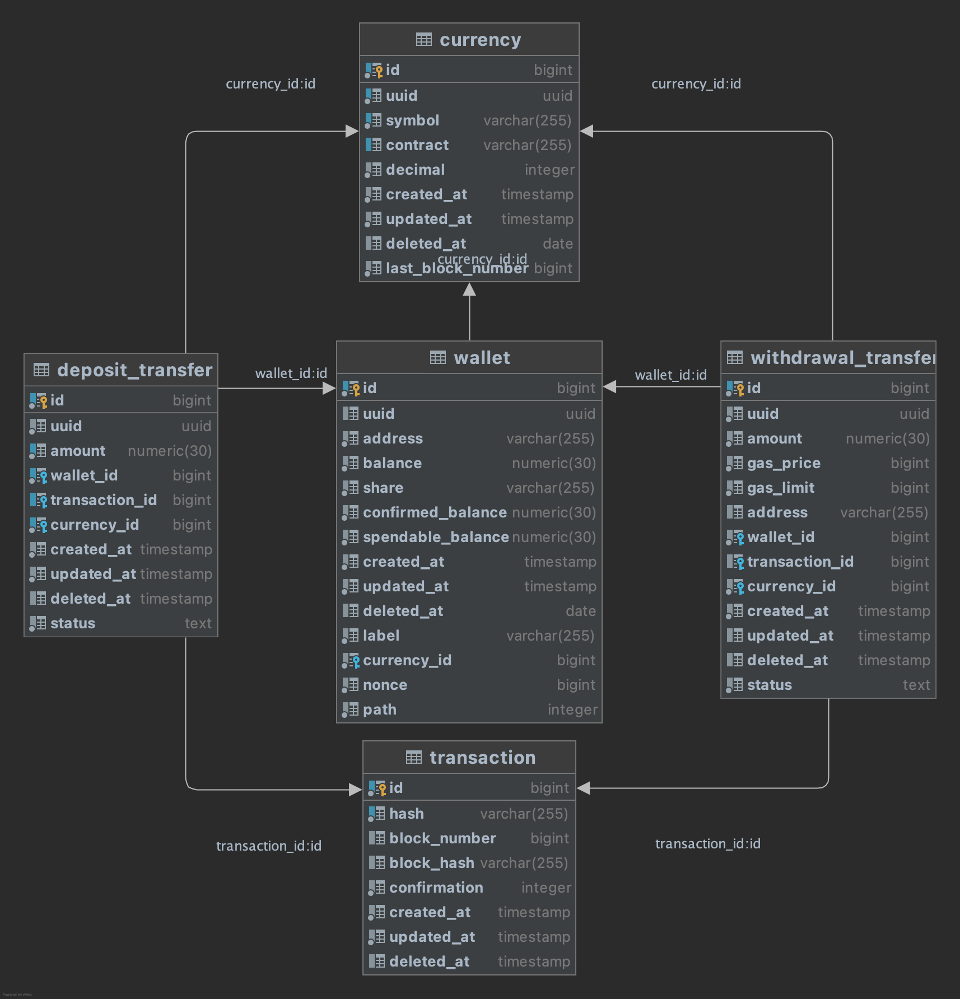

# Ethereum Wallet System

## Environment

* Java 11, Spring Boot
* PostgreSQL
* ActiveMQ

## To Run

```shell
docker-compose up
```

## Functions

* Create master wallet
* Create deposit addresses under master wallet
* Lookup master wallet's Ethereum balance
* Lookup deposit addresses' Ethereum balance
* Transfer Ethereum from master wallet
* Flush Ethereum from deposit addresses to master wallet

## DB Schema



## API

### POST `/api/wallet` (Create master wallet)

#### Request

```
{
    "label": "test"
}
```

#### Response

```
{
    "id": "ad151a55-c6ad-4270-bde6-b7af84fd213c",
    "label": "test",
    "address": "0x07587beb1cfa305d8eddb12307d8ac6c6dea81ed",
    "shares": [
        "2-4teDG0f2TAF9+lYjhoMOcKP8r+0TdfdnuxLBPP8G1Uko0wBBgSSerbTRyK+c09P3ee6j0m+7ECwCDHOlPqlBg3TNqP7t5Ppq3mcM/uSB3Hxk8dbVNkqDWW7LHQT3flAwpNu5FIdNbbLZ9CvBsFhAeooZbpJwOikzse0+GlS43XzbycAZj0n2KcpwJBn/EYObRwZZgN3XjhS1nQ==",
        "3-LgN9olY53pxwPckLfHcZckY9ygYq9b1g1CwWMj64BFSDJzlT8IloTVEkEM9rACc78SNHj2R7IYU2tXtAMc3d9nifxjAGLT1mDskzPiJ0CHXiu62GkFX2TGqSjje8c8aX5ofSJ/TQxtqPN4Ue+MhU/vmqSWXymoq3V6+eIUz0BfuPnbAs/Fw1oJf3i6+6rl9oUzPK0IqLfife4Q=="
    ]
}
```

### GET `/api/wallet/{walletId}` (Lookup master wallet's Ethereum balance)

#### Response

```
{
    "id": "ad151a55-c6ad-4270-bde6-b7af84fd213c",
    "label": "test",
    "address": "0x07587beb1cfa305d8eddb12307d8ac6c6dea81ed",
    "balance": 0,
    "confirmedBalance": 0,
    "spendableBalance": 0
}
```

### POST `/api/wallet/{walletId}/address` (Create deposit addresses under master wallet)

#### Request

```
{
    "share": "2-4teDG0f2TAF9+lYjhoMOcKP8r+0TdfdnuxLBPP8G1Uko0wBBgSSerbTRyK+c09P3ee6j0m+7ECwCDHOlPqlBg3TNqP7t5Ppq3mcM/uSB3Hxk8dbVNkqDWW7LHQT3flAwpNu5FIdNbbLZ9CvBsFhAeooZbpJwOikzse0+GlS43XzbycAZj0n2KcpwJBn/EYObRwZZgN3XjhS1nQ=="
}
```

#### Response

```
{
    "address": "0xfb6e7e48482479827894b451139bf69712dc0e6c"
}
```

### GET `/api/wallet/{walletId}/address/{address}` (Lookup deposit addresses' Ethereum balance)

#### Response

```
{
    "address": "0xfb6e7e48482479827894b451139bf69712dc0e6c",
    "balance": 0,
    "confirmedBalance": 0,
    "spendableBalance": 0
}
```

### POST `/api/wallet/{walletId}/send` (Transfer Ethereum from master wallet)

#### Request

```
{
    "currency": "eth",
    "address": "0xfb6e7e48482479827894b451139bf69712dc0e6c",
    "amount": "500000000000000000",
    "share": "2-4teDG0f2TAF9+lYjhoMOcKP8r+0TdfdnuxLBPP8G1Uko0wBBgSSerbTRyK+c09P3ee6j0m+7ECwCDHOlPqlBg3TNqP7t5Ppq3mcM/uSB3Hxk8dbVNkqDWW7LHQT3flAwpNu5FIdNbbLZ9CvBsFhAeooZbpJwOikzse0+GlS43XzbycAZj0n2KcpwJBn/EYObRwZZgN3XjhS1nQ==",
    "gasPrice": (Optional),
    "gasLimit": (Optional)
}
```

#### Response

```
{
    "id": "069ab4a9-6af0-4303-a126-8c4e3b5cac0a",
    "amount": 500000000000000000,
    "address": "0xfb6e7e48482479827894b451139bf69712dc0e6c",
    "gasPrice": 3983249390,
    "gasLimit": 21000,
    "transactionHash": "0xa795cb28603768c4799d931a0386bd10040817f1e7d034fb08f98a56fbaeffb1"
}
```

### POST `/api/wallet/{walletId}/flush` (Flush Ethereum from deposit addresses to master wallet)

#### Request

```
{
    "share": "2-4teDG0f2TAF9+lYjhoMOcKP8r+0TdfdnuxLBPP8G1Uko0wBBgSSerbTRyK+c09P3ee6j0m+7ECwCDHOlPqlBg3TNqP7t5Ppq3mcM/uSB3Hxk8dbVNkqDWW7LHQT3flAwpNu5FIdNbbLZ9CvBsFhAeooZbpJwOikzse0+GlS43XzbycAZj0n2KcpwJBn/EYObRwZZgN3XjhS1nQ=="
}
```

#### Response

```
[
    {
        "id": "b791deaf-2f88-446e-a522-d9885b31e04f",
        "amount": 499916351763230000,
        "address": "0x07587beb1cfa305d8eddb12307d8ac6c6dea81ed",
        "gasPrice": 3983249370,
        "gasLimit": 21000,
        "transactionHash": "0x889c538305ea55594c04cba0ec54cfdfeb195560a2ef7adde0d6b0ab1d21da7f"
    }
]
```

## TODO

* Interface segregation
* Support ERC20 tokens
* Ethereum node failover
* Test codes
* Swagger UI